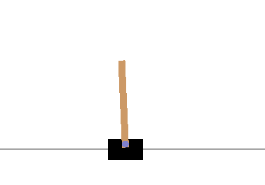
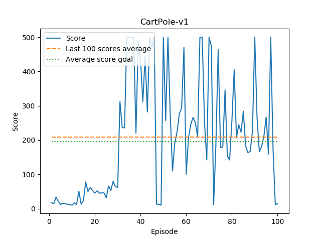

# Cartpole

Solution for [OpenAI's Cartpole](https://gym.openai.com/envs/CartPole-v0/).

## About

> A pole is attached by an un-actuated joint to a cart, which moves along a frictionless track. The system is controlled 
by applying a force of +1 or -1 to the cart. The pendulum starts upright, and the goal is to prevent it from falling over. 
A reward of +1 is provided for every timestep that the pole remains upright. The episode ends when the pole is 
more than 15 degrees from vertical, or the cart moves more than 2.4 units from the center. [source](https://gym.openai.com/envs/CartPole-v0/)

## Solution
Using standard DQN (Deep Q-network).

### Model architecture

1. Dense layer - input: **4**, output: **128**, activation: **relu**
2. Dense layer - input: **128**, output: **2**, activation: **linear**

* Loss function: **MSE**
* Optimizer: **Adam**

### Results

> CartPole-v0 defines "solving" as getting average reward of 195.0 over 100 consecutive trials. [source] (https://gym.openai.com/envs/CartPole-v0/)

#### Score

